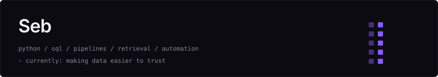
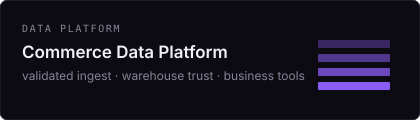
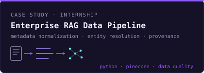
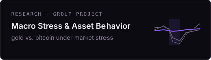

  

A pipeline you can't rerun safely is a liability with a scheduler.

## Selected work

**[Commerce Data Platform](https://github.com/sebmvp/commerce-data-platform)** — resale operations data into a DuckDB warehouse you can rebuild. Replay-safe ingest, quarantine, reconciliation, typed business tools over explicit metrics.

**[Enterprise RAG Data Pipeline](https://github.com/sebmvp/enterprise-rag-data-pipeline)** — Harpak-ULMA internship case study. I owned the offline side: inconsistent documents and equipment metadata into structured, validated records with provenance. Not the production retrieval app.

**[Macro Stress & Asset Behavior](https://github.com/sebmvp/macro-asset-stress-modeling)** — CompSci 390B research. Gold is a conditional safe haven; Bitcoin is not digital gold. I worked on model design, training, evaluation, and comparison.

## Currently

Commerce Data Platform — warehouse, trust, business tools. Copilot later.

## Off keyboard

Usually reading, training, traveling, or automating something that probably didn't need automating.

## Find me

- [linkedin.com/in/sebastianvaskes](https://www.linkedin.com/in/sebastianvaskes)
- [sebavaspim@gmail.com](mailto:sebavaspim@gmail.com)
